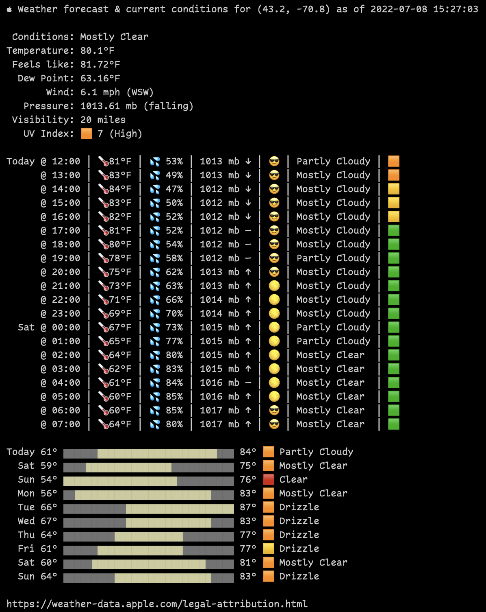

# weatherkit-rust

A Rust CLI program to print current conditions and daily/hourly forecast to the console.

Please read [`authorization.md`](authorization.md) as you need an Apple Developer Program membership and four environment variables set up to use this CLI tool. These are said env vars:

- `WEATHERKIT_KEY_ID`
- `WEATHERKIT_SERVICE_ID`
- `WEATHERKIT_TEAM_ID`
- `WEATHERKIT_KEY_PATH`

and the aforementioned document explains how to get each of those values from Apple.

ALSO NOTE that the program defaults to my location. Make sure to run it with params.

```
boB Rudis (@hrbrmstr)
Print Apple WeatherKit REST API weather conditions and hourly/daily foreacast to the console.

USAGE:
    weatherkit [OPTIONS]

OPTIONS:
    -h, --help           Print help information
        --lang <LANG>    [default: en]
        --lat <LAT>      [default: 43.2683199]
        --lon <LON>      [default: -70.8635506]
    -V, --version        Print version information
```

You get something like this:

